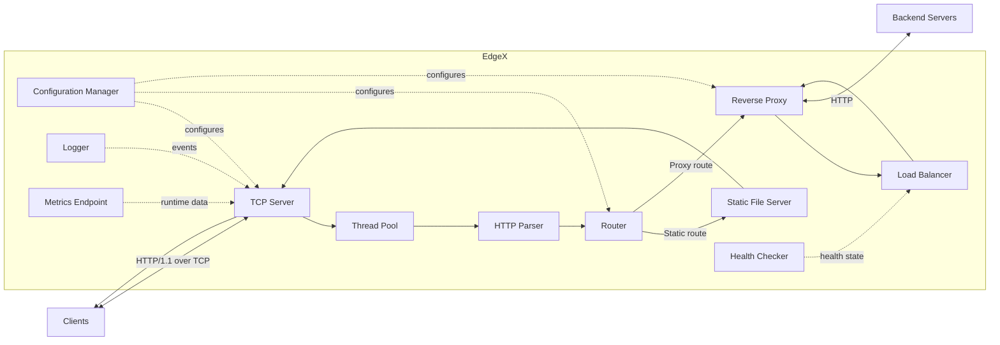

# EdgeX

> A modular backend infrastructure platform built from scratch in Modern C++17.

EdgeX is an educational, production-inspired backend infrastructure project. It is designed to explore how core backend systems work internally by implementing HTTP serving, routing, concurrency, reverse proxying, load balancing, health checks, observability, and configuration management without relying on a full web framework.

> **Project status:** Early development. The repository currently provides the modular C++17 scaffold, build tooling, and project documentation. Functional capabilities are delivered progressively through the [Roadmap](docs/Roadmap.md).

## Motivation

Most applications depend on web servers, load balancers, and proxies, yet the systems concepts behind them are often hidden by frameworks and managed platforms. EdgeX provides a focused environment for learning those concepts through implementation.

The project emphasizes:

- TCP and HTTP/1.1 protocol fundamentals.
- Resource-safe systems programming with Modern C++.
- Clear module boundaries and testable interfaces.
- Production-inspired operational practices: logging, metrics, configuration, and benchmarking.

EdgeX is intended for learning, experimentation, and portfolio development. It is not currently intended for internet-facing production deployment.

## Features

### Foundation available now

- Modern C++17 project scaffold.
- Modular public-header and source layout.
- CMake build configuration and debug/release presets.
- Compiler-warning configuration.
- Documentation, coding standards, Git workflow, and v1.0 roadmap.

### Version 1.0 target features

- HTTP/1.1 TCP server.
- HTTP request parser and response builder.
- Method- and path-based router.
- Static file server with path-traversal protection.
- Configurable thread pool.
- Reverse proxy.
- Round-robin load balancer.
- Backend health checker.
- Configurable logging.
- Runtime metrics endpoint.
- Benchmarking utilities.
- File-based configuration management.

## Planned Features

The v1.0 implementation order is tracked in the [Roadmap](docs/Roadmap.md). Major milestones include:

1. Socket Layer and TCP Server.
2. HTTP Parser, Response Builder, Router, and Static File Server.
3. Thread Pool and Logger.
4. Reverse Proxy, Load Balancer, and Health Checker.
5. Metrics, Benchmarking, Documentation, and Release.

## Project Architecture



For proxied requests, the load balancer selects a healthy upstream backend and the reverse proxy performs the HTTP forwarding. Detailed design material is available in the [architecture document](docs/architecture.md).

## Directory Structure

```text
EdgeX/
|- include/edgex/       # Public headers grouped by module
|  |- net/              # Socket and TCP interfaces
|  |- http/             # HTTP request and response interfaces
|  |- routing/          # Route matching interfaces
|  |- static/           # Static-file-serving interfaces
|  |- concurrency/      # Threading and task execution interfaces
|  |- proxy/            # Proxy, load-balancing, and health interfaces
|  |- observability/    # Logging and metrics interfaces
|  |- config/           # Configuration interfaces
|  `- common/           # Focused shared abstractions
|- src/                 # Implementations mirroring module ownership
|- tests/               # Unit tests, integration tests, and fixtures
|- benchmarks/          # Performance benchmarks
|- config/              # Safe example configuration files
|- docs/                # Specifications, architecture, standards, and diagrams
|- scripts/             # Developer automation
|- assets/              # Documentation and demo assets
|- cmake/               # Reusable CMake modules
|- examples/            # Small usage examples
`- third_party/         # Explicitly managed vendored dependencies, if needed
```

## Build Instructions

### Prerequisites

- CMake 3.21 or later.
- A C++17-compliant compiler:
  - MSVC 2022 or later on Windows.
  - GCC 9 or later on Linux.
  - Clang 10 or later on macOS or Linux.
- Ninja is recommended when using CMake presets.

### Build with CMake presets

```powershell
cmake --preset debug
cmake --build --preset debug
ctest --preset debug
```

### Build directly with CMake

```powershell
cmake -S . -B build -DCMAKE_BUILD_TYPE=Debug
cmake --build build
ctest --test-dir build --output-on-failure
```

On Windows with Visual Studio, configure with a Visual Studio generator or run the commands from a Developer PowerShell.

## Usage

The current scaffold builds an `edgex` executable that confirms the application version:

```powershell
.\out\build\debug\edgex
```

Expected output:

```text
EdgeX backend scaffold v0.1.0
```

As v1.0 modules are delivered, EdgeX will load runtime settings from configuration files such as [config/example.yaml](config/example.yaml). The eventual server workflow will be documented here with command-line and configuration examples.

## Roadmap

Sprint 1 targets the first complete EdgeX release, `v1.0.0`.

- [ ] Socket Layer
- [ ] TCP Server
- [ ] HTTP Parser
- [ ] Response Builder
- [ ] Router
- [ ] Static File Server
- [ ] Thread Pool
- [ ] Logger
- [ ] Reverse Proxy
- [ ] Load Balancer
- [ ] Health Checker
- [ ] Metrics
- [ ] Benchmarking
- [ ] Documentation and Release

See the detailed, deliverable-based [Roadmap](docs/Roadmap.md).

## Documentation

- [Software Requirements Specification](docs/SRS.md)
- [Architecture](docs/architecture.md)
- [Design Decisions](docs/design-decisions.md)
- [Coding Standards](docs/coding-standards.md)
- [Git Workflow](docs/git-workflow.md)
- [Roadmap](docs/Roadmap.md)

## Contributing

Contributions, design discussions, and issue reports are welcome as the project evolves.

1. Read the [Coding Standards](docs/coding-standards.md) and [Git Workflow](docs/git-workflow.md).
2. Create a focused branch, for example `feature/http-parser` or `fix/request-timeout`.
3. Add or update tests for behavioral changes.
4. Ensure the project builds and relevant tests pass.
5. Open a pull request using a focused title and Conventional Commit-style description.

Please keep changes small, avoid unrelated formatting changes, and document meaningful API or architectural decisions.

## License

EdgeX is licensed under the [MIT License](LICENSE).

## Future Scope

Future releases may explore:

- HTTPS and TLS support.
- HTTP/2 and improved connection handling.
- WebSockets.
- Authentication, authorization, and rate limiting.
- Caching and additional load-balancing strategies.
- Service discovery and dynamic backend registration.
- Distributed tracing and richer metrics integration.
- Event-driven I/O using `epoll`, `kqueue`, or platform-specific alternatives.
- Containerized deployment and CI automation.
- Database, message-queue, and distributed-system integration.

These capabilities are intentionally outside the scope of EdgeX v1.0.
