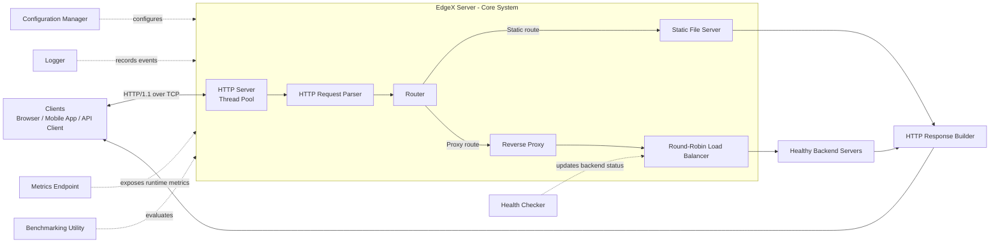

# Software Requirements Specification (SRS)

## EdgeX — Version 1.0

## 1. Introduction

EdgeX is a modular backend infrastructure platform developed in Modern C++17. The project provides a practical environment for learning the core building blocks of production-grade backend systems, including networking, concurrency, routing, proxying, configuration, and observability.

This document defines the software requirements for EdgeX version 1.0. The platform is intended for educational and experimental use, rather than as a replacement for mature internet-facing server infrastructure.

## 2. Purpose

The purpose of EdgeX is to demonstrate the design and implementation of a lightweight backend infrastructure platform capable of receiving HTTP requests, routing them to appropriate handlers or upstream services, serving static content, and exposing operational information.

The system is designed to help developers understand backend systems by implementing essential concepts from scratch in Modern C++17.

## 3. Scope

EdgeX version 1.0 shall provide the following capabilities:

- HTTP request acceptance and response delivery.
- HTTP request parsing and validation.
- HTTP response construction.
- URL-based request routing.
- Static file serving.
- Multithreaded request processing through a thread pool.
- Reverse proxying to backend services.
- Round-robin load balancing across configured backend instances.
- Basic backend health checking.
- Application logging.
- File-based configuration management.
- A metrics endpoint for operational visibility.
- Benchmarking support for performance evaluation.

The system shall support plain HTTP/1.1 communication over TCP connections.

## 4. Product Overview

EdgeX is a standalone backend application written in C++17. It accepts incoming HTTP requests and selects the appropriate processing path according to configured routes.

A request may be served as a static file, handled by a local route handler, forwarded to an upstream service through the reverse proxy, or rejected with a suitable HTTP error response. A thread pool enables concurrent request processing. Logging, health checks, configuration management, metrics, and benchmarks provide supporting operational capabilities.

## 4.1 High-Level Architecture

The following diagram is a correct high-level representation of the EdgeX request path. The reverse proxy is responsible for forwarding a request, while the round-robin load balancer selects a healthy backend instance for that request. The thread pool supports concurrent execution within the HTTP server; configuration, logging, metrics, health checking, and benchmarking are cross-cutting supporting services.

**Architecture notes:**

- The request flow is: Client -> HTTP Server -> HTTP Request Parser -> Router -> Static File Server or Reverse Proxy -> Load Balancer -> Backend Server -> HTTP Response Builder -> Client.
- The logical placement of the load balancer after the reverse proxy is valid: the proxy uses it to select an available upstream backend before establishing the forwarding connection.
- The health checker influences backend selection by marking unavailable instances unhealthy.
- Static-file responses bypass the reverse proxy and load balancer.
- The diagram supplied with this SRS does not show the Thread Pool or Benchmarking utility; they are included above because both are in scope for version 1.0.

## 5. Functional Requirements

### 5.1 HTTP Server

- **FR-01:** The system shall listen for incoming TCP connections on a configurable host address and port.
- **FR-02:** The system shall accept and process HTTP/1.1 requests.
- **FR-03:** The system shall support persistent connections where feasible within the limits of version 1.0.
- **FR-04:** The system shall return valid HTTP status codes and response headers.
- **FR-05:** The system shall return an appropriate error response for malformed or unsupported requests.

### 5.2 HTTP Request Parser

- **FR-06:** The system shall parse the HTTP method, request path, protocol version, headers, and optional request body.
- **FR-07:** The parser shall validate the basic syntax of incoming HTTP requests.
- **FR-08:** The parser shall identify invalid request structures and enable the server to generate an appropriate client error response.
- **FR-09:** The parser shall support GET, POST, PUT, DELETE, and HEAD methods where applicable.

### 5.3 HTTP Response Builder

- **FR-10:** The system shall construct HTTP responses containing a status line, headers, and an optional body.
- **FR-11:** The response builder shall include content length when applicable.
- **FR-12:** The response builder shall support configurable response headers.
- **FR-13:** The response builder shall support standard error responses, including 400, 404, 500, 502, and 503.

### 5.4 Router

- **FR-14:** The system shall route requests according to HTTP method and request path.
- **FR-15:** The router shall support registration of static routes.
- **FR-16:** The router shall direct requests to local handlers, static-file handlers, or reverse-proxy handlers.
- **FR-17:** The router shall return a 404 Not Found response when no matching route exists.

### 5.5 Static File Server

- **FR-18:** The system shall serve files from a configured document root.
- **FR-19:** The system shall determine the content type of commonly supported static files based on file extension.
- **FR-20:** The system shall return a 404 Not Found response when a requested file does not exist.
- **FR-21:** The system shall prevent path traversal attempts outside the configured document root.
- **FR-22:** The system shall return an appropriate error response when a requested file cannot be read.

### 5.6 Thread Pool

- **FR-23:** The system shall use a configurable thread pool for concurrent request processing.
- **FR-24:** The thread pool shall maintain a queue of pending tasks.
- **FR-25:** The thread pool shall safely execute submitted tasks across worker threads.
- **FR-26:** The system shall support graceful thread-pool shutdown during application termination.

### 5.7 Reverse Proxy

- **FR-27:** The system shall forward configured requests to upstream backend services.
- **FR-28:** The reverse proxy shall preserve relevant request information, including method, path, headers, and body.
- **FR-29:** The reverse proxy shall return the upstream response to the client where possible.
- **FR-30:** The system shall return a 502 Bad Gateway response if communication with a selected upstream service fails.
- **FR-31:** The reverse proxy shall support configurable upstream connection and response timeouts.

### 5.8 Round-Robin Load Balancer

- **FR-32:** The system shall distribute proxied requests among configured healthy backend instances using a round-robin strategy.
- **FR-33:** The load balancer shall avoid selecting backend instances marked unhealthy.
- **FR-34:** The load balancer shall continue operating when one or more backend instances are unavailable, provided at least one healthy instance remains.
- **FR-35:** The system shall return a 503 Service Unavailable response when no healthy backend instance is available.

### 5.9 Health Checker

- **FR-36:** The system shall periodically perform health checks on configured backend instances.
- **FR-37:** The health-check interval and timeout shall be configurable.
- **FR-38:** The system shall maintain the health status of each backend instance.
- **FR-39:** The system shall log health-status transitions.

### 5.10 Logging

- **FR-40:** The system shall log startup, shutdown, error, warning, and informational events.
- **FR-41:** The system shall log request method, path, response status, and processing duration.
- **FR-42:** The logging level shall be configurable.
- **FR-43:** The system shall support configurable log output, such as console or file output.

### 5.11 Configuration Management

- **FR-44:** The system shall load runtime configuration from an external configuration file.
- **FR-45:** Configuration shall include server address, port, thread-pool size, document root, routes, upstream servers, health-check settings, and logging settings.
- **FR-46:** The system shall validate configuration values at startup.
- **FR-47:** The system shall terminate gracefully with a clear error message when required configuration is invalid or missing.

### 5.12 Metrics Endpoint

- **FR-48:** The system shall expose a configurable HTTP endpoint for runtime metrics.
- **FR-49:** The endpoint shall provide at least total request count, error count, active connections where available, request latency information, and backend health status.
- **FR-50:** The metrics endpoint shall be accessible through an HTTP GET request.
- **FR-51:** Metrics shall be updated safely in concurrent execution environments.

### 5.13 Benchmarking

- **FR-52:** The project shall provide a benchmarking mechanism or utility to evaluate server throughput and response latency.
- **FR-53:** Benchmark results shall include total requests, successful requests, failed requests, elapsed time, and latency-related measurements.
- **FR-54:** Benchmarking shall support configurable request count and concurrency level.

## 6. Non-Functional Requirements

### 6.1 Performance

- **NFR-01:** The system shall process concurrent client requests using multiple worker threads.
- **NFR-02:** The system should minimize unnecessary memory allocations during request parsing and response generation.
- **NFR-03:** The system should provide benchmarkable throughput and latency measurements.
- **NFR-04:** Response latency shall be logged or measurable for performance analysis.

### 6.2 Reliability

- **NFR-05:** The system shall handle malformed requests without crashing.
- **NFR-06:** Failure of an individual backend instance shall not terminate the EdgeX process.
- **NFR-07:** The system shall return meaningful HTTP error responses for recoverable failures.
- **NFR-08:** Shared resources shall be protected against race conditions.

### 6.3 Maintainability

- **NFR-09:** The system shall maintain clear separation between networking, parsing, routing, proxying, logging, configuration, and metrics components.
- **NFR-10:** The codebase shall follow modern C++17 practices and use RAII for resource management.
- **NFR-11:** Public interfaces and major components shall be documented.
- **NFR-12:** The project shall include unit tests for core components where practical.

### 6.4 Portability

- **NFR-13:** The project shall compile using a C++17-compliant compiler.
- **NFR-14:** The code should be designed to run on common desktop or server operating systems, subject to platform-specific socket abstractions.
- **NFR-15:** Build instructions and dependency requirements shall be documented.

### 6.5 Security

- **NFR-16:** The static file server shall prevent directory traversal vulnerabilities.
- **NFR-17:** The system shall validate request size and structure to reduce risks from malformed input.
- **NFR-18:** Sensitive configuration values, if introduced later, shall not be written to logs by default.
- **NFR-19:** Version 1.0 shall operate only over unencrypted HTTP and shall document this limitation.

## 7. Assumptions

- EdgeX will run in a trusted development, academic, or controlled testing environment.
- Configured backend services are reachable through a permitted local or network environment.
- Users provide valid configuration files before starting the application.
- The host operating system provides standard TCP socket functionality and thread support.
- Benchmarking is performed in a controlled environment so results can be interpreted meaningfully.
- Users understand that EdgeX is an educational project and is not intended for internet-facing production deployment.

## 8. Constraints

- The implementation language shall be Modern C++17.
- Version 1.0 shall support HTTP/1.1 only.
- HTTPS and TLS encryption shall not be implemented.
- HTTP/2 and HTTP/3 shall not be supported.
- WebSocket communication shall not be supported.
- Authentication and authorization mechanisms shall not be included.
- Database integration and persistent data storage shall not be included.
- The system shall not implement `epoll`-based event handling.
- Distributed-system features, including clustering, service discovery, consensus, and replication, shall not be included.
- The platform shall remain focused on core backend and networking concepts rather than feature completeness.

## 9. Future Scope

Future versions of EdgeX may introduce:

- HTTPS and TLS support.
- HTTP/2 and advanced connection management.
- WebSocket support for real-time communication.
- Authentication, authorization, API keys, and rate limiting.
- Dynamic route registration and middleware support.
- Caching for static files and proxied responses.
- Advanced load-balancing algorithms, such as least-connections and weighted round robin.
- Service discovery and dynamic backend registration.
- Distributed tracing and richer metrics formats.
- Event-driven I/O using `epoll`, `kqueue`, or platform-specific high-performance APIs.
- Containerization and deployment support using Docker.
- Database and message-queue integration.
- Distributed deployment, fault tolerance, and horizontal scaling.
