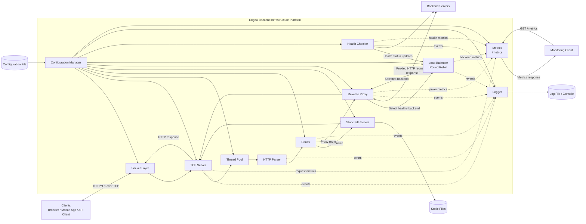

## EdgeX High-Level Architecture

EdgeX should be organized as a layered, modular HTTP infrastructure platform. The request path is:

`Client -> TCP Server -> HTTP Parser -> Router -> Static File Server or Reverse Proxy -> HTTP Response -> Client`

For proxied requests, the reverse proxy asks the load balancer to select a healthy backend, then forwards the request to that backend.

| Module | Responsibility | Inputs | Outputs | Dependencies | Why it exists |
|---|---|---|---|---|---|
| Socket Layer | Provides low-level operating-system socket abstractions for creating, binding, listening, accepting, reading, writing, and closing TCP connections. | Host, port, socket options, raw byte buffers. | Socket handles, received bytes, transmitted bytes, socket errors. | OS networking APIs, Configuration Manager, Logger. | Isolates platform-specific socket code from the rest of EdgeX. |
| TCP Server | Owns the server lifecycle and manages client connections. Assigns work to worker threads. | Accepted sockets, raw client data, server configuration. | Request-processing tasks, raw HTTP responses. | Socket Layer, Thread Pool, HTTP Parser, Logger, Metrics. | Provides the network entry point for all incoming client requests. |
| HTTP Parser | Converts raw HTTP/1.1 bytes into a structured request object and validates request syntax. | Raw request bytes. | `HttpRequest` object or parse error. | Logger, configuration limits such as maximum request size. | Separates protocol parsing from connection management and business routing. |
| Router | Matches a valid request to a configured local handler, static-file route, or proxy route. | `HttpRequest`, route configuration. | Route decision and target handler. | Configuration Manager, Static File Server, Reverse Proxy, Logger. | Centralizes path- and method-based routing decisions. |
| Static File Server | Resolves and serves files from the configured document root. | Static-file route, request path, document-root configuration. | File content or HTTP error result. | File system, Configuration Manager, Logger, Metrics. | Enables EdgeX to serve static assets without requiring an upstream service. |
| Thread Pool | Executes request-processing tasks concurrently using a fixed or configurable worker set. | Request tasks, worker-count configuration. | Completed tasks and execution status. | TCP Server, Logger, Metrics, Configuration Manager. | Prevents one request from blocking the server’s ability to process other connections. |
| Reverse Proxy | Forwards eligible client requests to the selected upstream backend and returns its response. | `HttpRequest`, proxy route settings, selected backend. | Upstream HTTP response or proxy error. | Load Balancer, Socket Layer or HTTP client utility, Logger, Metrics, Configuration Manager. | Allows EdgeX to act as an intermediary in front of backend services. |
| Load Balancer | Selects an eligible backend instance using round-robin scheduling. | Upstream pool, backend health state. | Selected backend endpoint or “no backend available.” | Health Checker, Configuration Manager, Logger, Metrics. | Distributes traffic across backend instances and avoids unhealthy targets. |
| Health Checker | Periodically evaluates backend availability and updates their health status. | Backend list, health-check interval, timeout. | Health-state updates: healthy or unhealthy. | Socket Layer/HTTP client utility, Load Balancer, Configuration Manager, Logger, Metrics. | Prevents the load balancer from routing requests to unavailable backends. |
| Logger | Records application events for debugging, auditing, and operations. | Log events, levels, context, errors. | Console output and/or log-file records. | Configuration Manager, file system. | Provides visibility into startup, requests, failures, and health transitions. |
| Metrics | Collects and exposes runtime measurements through a metrics endpoint. | Request counts, latency, error counts, connection statistics, backend health state. | Metrics response, such as `/metrics`. | TCP Server, Reverse Proxy, Load Balancer, Health Checker, Configuration Manager. | Makes system behavior measurable during testing and operation. |
| Configuration Manager | Loads, validates, and exposes runtime configuration. | Configuration file, command-line values if supported. | Validated configuration objects. | File system, Logger. | Keeps environment-specific settings outside source code and provides a single configuration authority. |

## High-Level Component Diagram

The key architectural choice is that the **load balancer selects** an upstream backend, while the **reverse proxy performs the actual forwarding**. This keeps backend-selection logic independent from HTTP forwarding logic and makes both modules easier to test and extend.