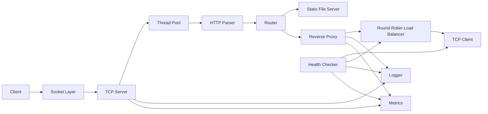

# EdgeX Component Diagram

The diagram shows the major v1.0 modules and their primary relationships.

The important separation is between **selection** and **forwarding**: the load balancer selects a healthy backend while the reverse proxy owns the upstream HTTP exchange.
