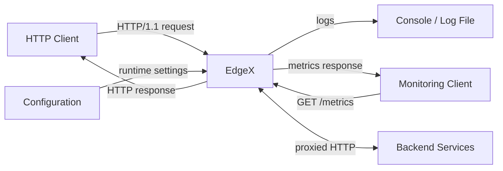
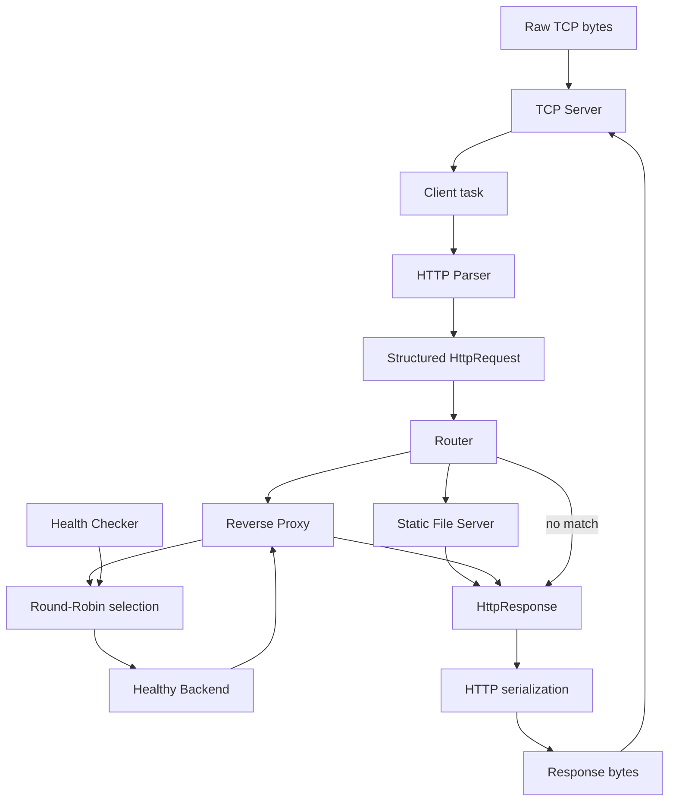

# EdgeX Data Flow Diagram

## Level 0 — System Context

## Level 1 — Request Data Flow

## Data-flow notes

- TCP bytes become a structured `HttpRequest` only after parser validation.
- The router decides whether data flows to a local/static handler or the proxy path.
- The load balancer contributes a backend endpoint; it does not perform the HTTP forwarding itself.
- Health-check results modify backend eligibility.
- Responses are represented as `HttpResponse` objects before serialization.
- Logging and metrics observe system activity without becoming part of the request-routing decision itself.
