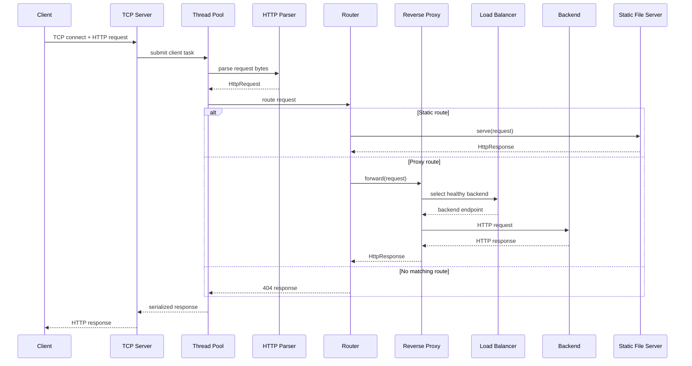

# EdgeX Request Sequence Diagram

The thread pool owns execution concurrency; the parser owns protocol decoding; the router owns local dispatch; and proxy/load-balancer responsibilities remain separate.
